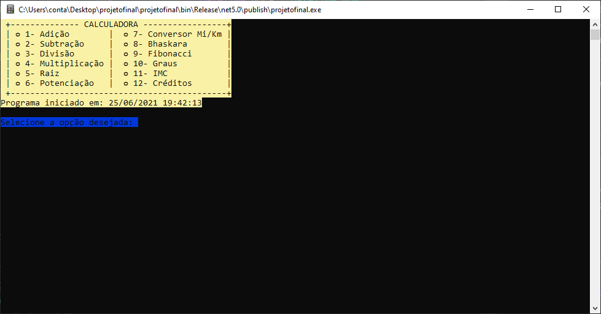
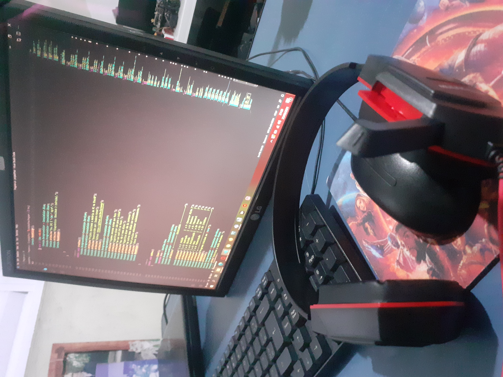

# PRIMEIRO PROJETO DESENVOLVIDO EM C# #

Esse projeto é destinado a matéria de Programação de Computadores.
> O programa contém:
> * As quatro operações aritméticas básicas (soma, subtração, multiplicação e divisão);
>* Exponenciação e radiciação;
>* Bônus de outras operações.
>

## _Screenshot_
> Tela inicial do programa.
 

## _Dowload_
♦ Baixe o arquivo. Descompacte na pasta desejada.🤓
* [📥Dowload do arquivo.zip](dist/ProjetoCalculadora.zip)

---
## Agradecimentos ##
Agradeço aos meus professores - Diego Neri e Ermogenes Palacio - pelas aulas ministradas e pelo conhecimento que foi transmitido.
> 

* [Prof.Ermogenes](https://github.com/ermogenes)
* [Prof.Diego](https://github.com/diegoneri)
* [Dev.Isadora](https://github.com/DevIqcKondo)
* [Figgle](https://www.nuget.org/packages?q=FIGGLE)

---

 

---

